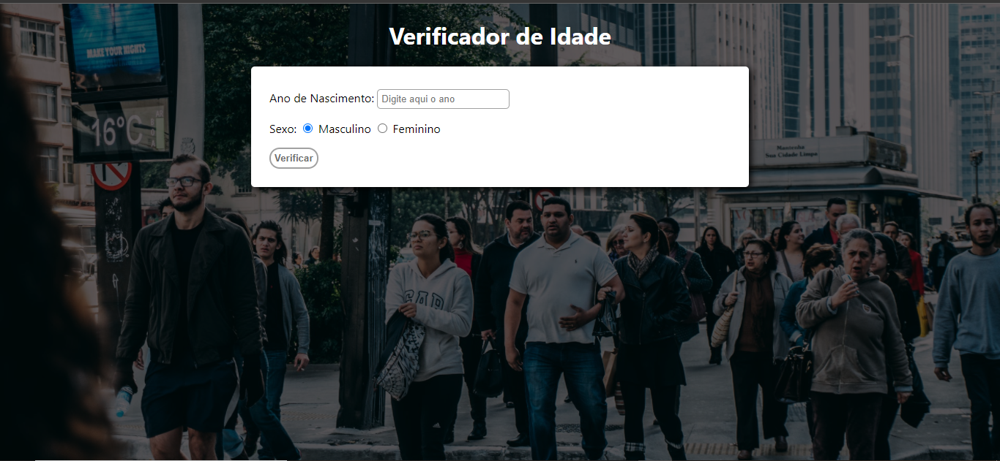
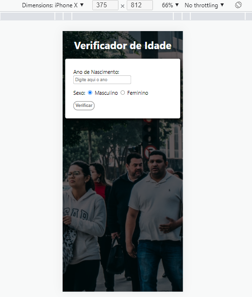
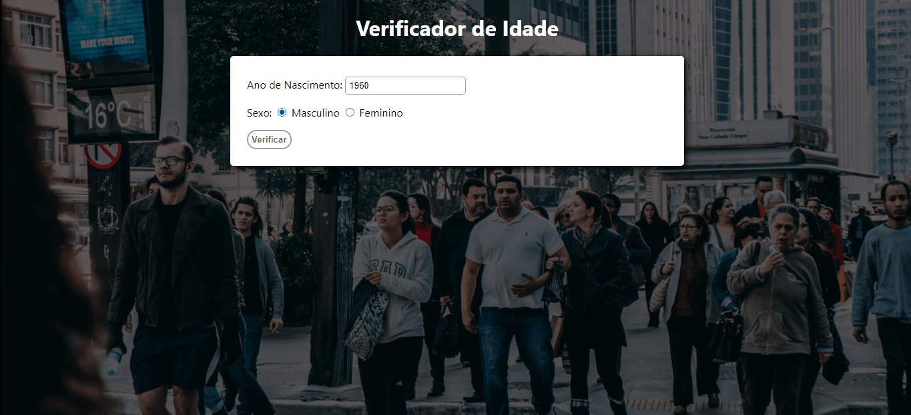
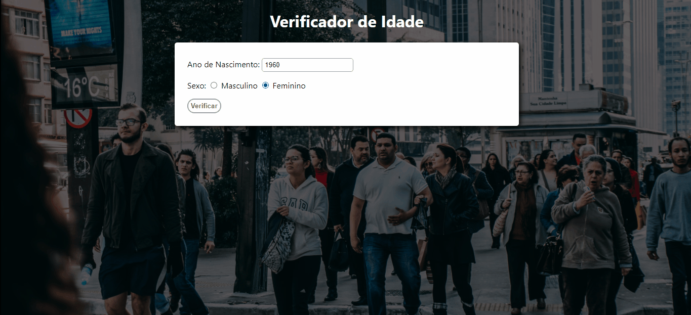

<h1>Hora do Dia</h1>

<!-- FOTOS -->

    <h2> 📸 Fotos </h2>
        
          
        
          
        
   <h2> 🎥 GIFs </h2>
        
          

  

<!-- LINKS -->

    <!-- <h3 style="text-align:center">Link do Projeto <a href="https://lucasfrancobn.github.io/Verificador-de-Idade/">CLIQUE AQUI</a></h3> -->
    <a href="#sobre">Sobre o Projeto</a> - 
    <a href="#tec">Tecnologias</a>

 

<!-- SOBRE -->

    <h2> 📝 Sobre o Projeto </h2> 
    
 Esse Projeto foi feito no intuito de verificar a <stong>Idade</strong> de uma pessoa, dependendo do <strong>Ano de Nascimento</strong> e do <strong>Sexo</strong> biológico da pessoa. Depois do usuário escolher um ano de nascimento e o sexo, o verificador mostrará a idade e uma foto de uma pessoa da mesma idade.

 

<!-- TECNOLOGIAS -->

<h2> 🖥️ Tecnologias</h2>
    
 ✔️ HTML 5 

    
 ✔️ CSS 3 

    
 ✔️ JavaScript 

